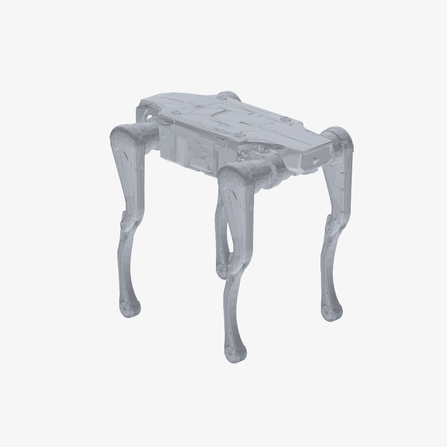
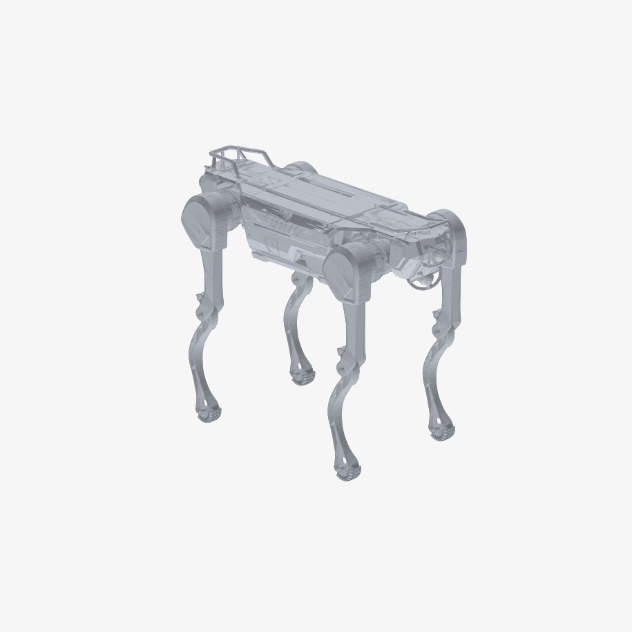
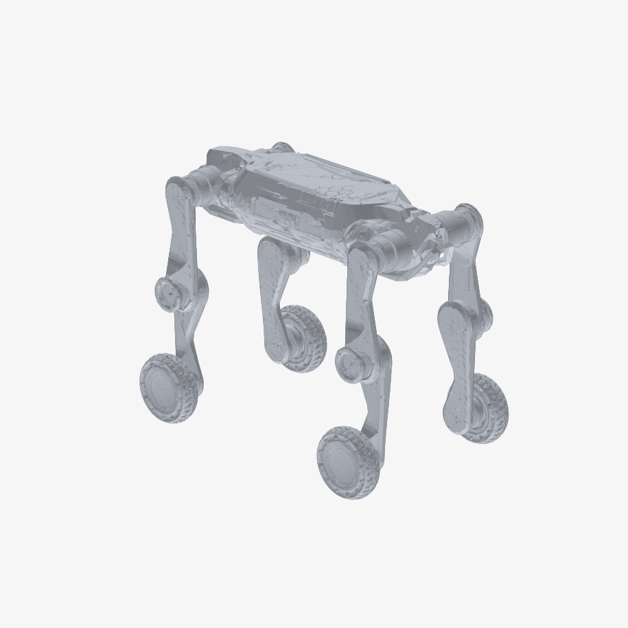
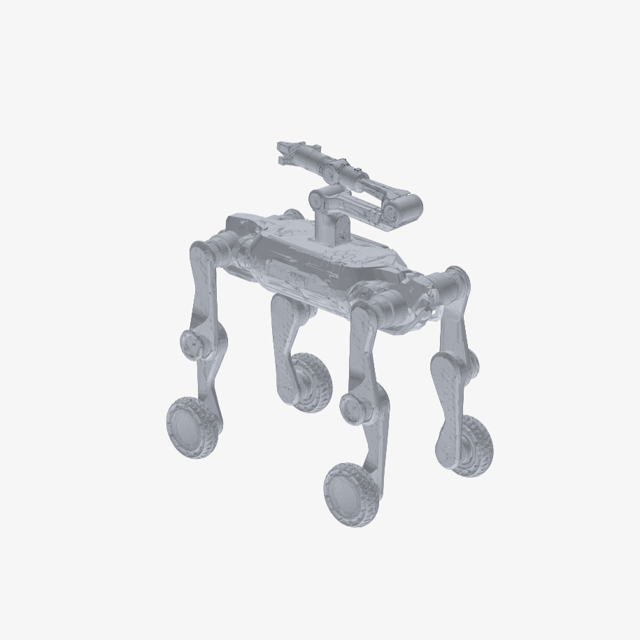
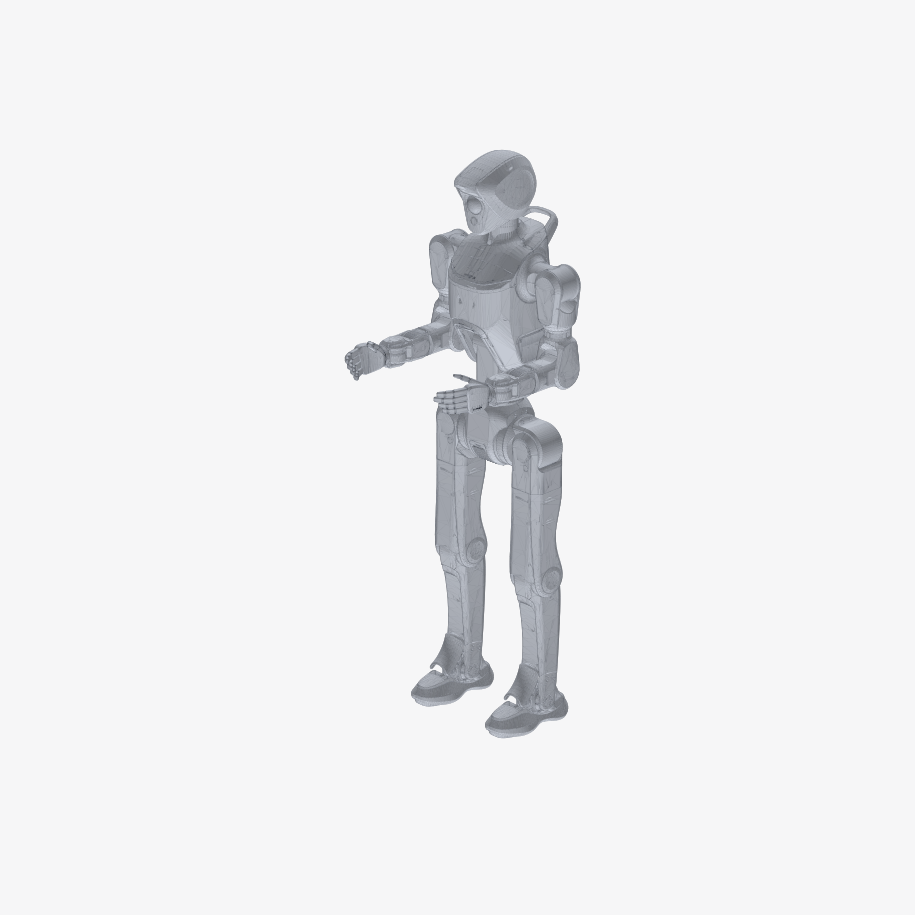
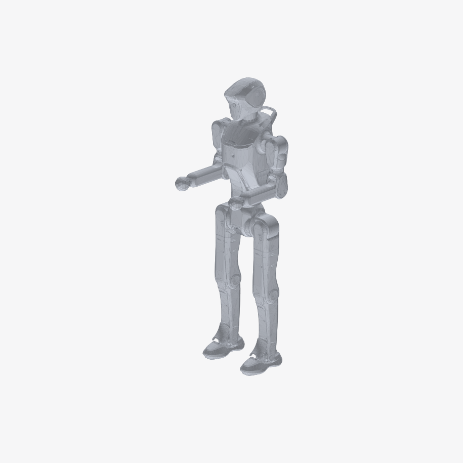

# Robot Models Repository

This repository contains 3D models for seven Deep Robotics robots: **Lite3**, **M20**, **M20S**, **X30**, **M20_Piper**, **DR02 Pro**, and **DR02 Standard**. Each model is provided in MJCF, URDF, and USD formats. To visualize a model and take measurements, we recommend using this [viewer tool](https://viewer.robotsfan.com/) — just drag the model folder onto the web page.

High-resolution models are available on [Google Drive](https://drive.google.com/drive/folders/1EOELXUYSBPEJeD0rUIkJxnlLMDr6IHBV?usp=sharing) and are intended for use with modern simulators such as Isaac Lab and Isaac Sim. The low-resolution models bundled in this repository are provided for broad compatibility with older simulators.

## Model Overview

| Robot Model | High Resolution Image | Low Resolution Image |
|:-----------:|:---------------------:|:--------------------:|
| **Lite3** |  |  |
| **X30** |  |  |
| **M20** |  |  |
| **M20S** | Not available yet |  |
| **M20_Piper** | Not available yet |  |
| **DR02 Pro** | Not available yet |  |
| **DR02 Standard** | Not available yet |  |

## Contributors
See the [Contributors](Contributors.md) page for a list of contributors.
